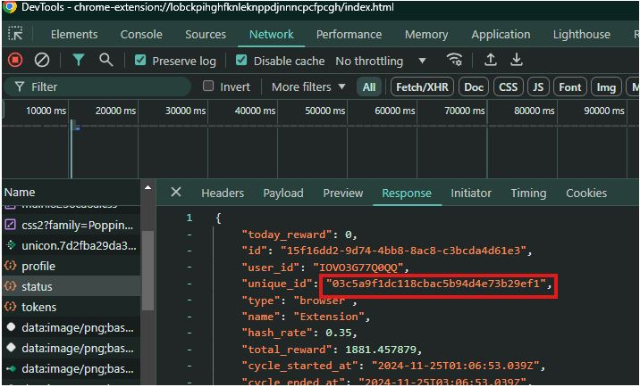

# MeshChain-bot
Tool Guide
File token.txt contains access_token|refresh_token
The unique_id.txt file contains unique IDs.
Instructions for getting data
Download File

"npm install" command to install module
command "node main.js" to run the bot
"node withdraw.js" command to check balance and withdraw money
command "node getToken.js" to get token from Account file

